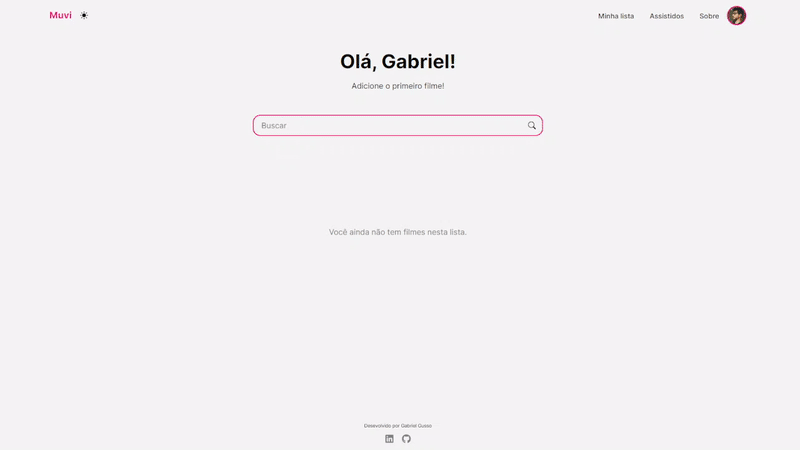
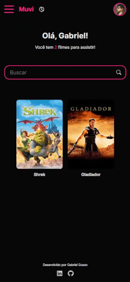

# Muvi

**Muvi** (que eu decidi chamar assim porque o nome era curto e legal o suficiente para soar como uma marca) é mais uma daquelas aplicações de estudos baseadas em listas de usuário.
  
Na aplicação, o usuário pode criar uma conta para registrar os filmes que já assistiu e aqueles que quer assistir. Os dados dos filmes são providenciados pela TMDB, mas as contas e listas de usuário estão guardadas em servidor próprio.
  
É, sobretudo, o resultado de duas semanas de leitura de documentações para aprender como manejar autenticações e databases.
 

 

 

 

# **💻 Stack**

A stack utilizada foi:

-    [NextJs](#nextjs)
-    [NextAuth](#nextauth)
-    [Prisma](#prisma)
-    [MongoDB](#mongodb)
-    [SWR](#swr)
-    [The Movie Database (TMDB)](#tmdb)

 

## NextJs

A escolha do Next como framework foi baseada na facilidade de criações de rotas API na própria aplicação, isto é, sem a necessidade de criação de rotas em outros servidores com Node. Foram criadas quatro handlers (sem contar a do NextAuth) para requests feitas no cliente, mas controladas pelo servidor: para registro de usuário com credenciais, para busca de dados do usuário na database, para atualização destes dados e para a busca individualizada de filmes na TMDB.

O NextJS também oferece otimização integrada de imagens, o que vem muito a calhar em uma aplicação que mostra dezenas de imagens (pôsteres) em cada página.

 

## NextAuth 

O NextAuth é uma library de autenticação de usuário criada para o Next. Ela oferece suporte para autenticação com credenciais e OAuth com outros providers. Nesta aplicação, utilizei os providers do Google e do Github. Além disso, o NextAuth conta com suporte para o Prisma, o que facilita o registro das informações na database.

 

## MongoDB

MongoDB é um sistema open source de organização de database NoSQL. A estrutura básica é feita de Collections (análogas às tables do SQL) e Documents. Uma Collection é um grupo de Documents, e um Document contém objetos individuais (como um usuário, por exemplo).

 

## Prisma

Prisma é uma ferramente de ORM (Object-Relational Mapping), isto é, um recurso para estruturar e operar databases. Ele oferece, além disso, um cliente para manipular e consultar a database gerada.

A estruturação é feita através de um esquema, que é depois integrado ao sistema escolhido. Em outras palavras, pode-se utilizar o Prisma para definir (e tipar, pois o Prisma utiliza Typescript) os campos de cada documento na database, como e-mail (string), senha (string) ou lista de filmes (array), e também declarar as relações entre campos, documentos e coleções (atrelar um ID de usuário a uma coleção de filmes, por exemplo).

Alguns documentos foram criados com base nos dados recebidos da autenticação por provedores externos. Já o documento User foi criado para guardar informações mais específicas, como as listas de filmes assistidos e não assistidos.

 

## SWR

SWR é ~um presente dos céus~ uma técnica de data-fetching criada pela Vercel, a mesma companhia por trás do Next. Através do hook useSWR é possível salvar os dados recebidos de uma API e guardá-los em um cache no cliente, compartilhado por toda a aplicação e revalidado automaticamente (ou conforme as nossas especificações).

Assim, sempre que uma request for feita à mesma API, todos os componentes que utilizam o hook receberão dados atualizados, sem precisar fazer outras requests enquanto os dados forem válidos.

O uso mais importante do SWR nesta aplicação foi a função mutate(). Ela permite adicionar dados diretamente ao cache sem fazer outra request à API. Deste modo, cada vez que um usuário adiciona ou exclui um filme de alguma lista, podemos enviar diretamente os dados do filme ao cache e evitar que outras dezenas de solicitações sejam feitas à TMDB para obter os dados da nova lista e renderizá-los no cliente. Como os hooks feitos à mesma API são compartilhados pela aplicação, é possível alterar o cache sem precisar criar contextos ou passar props através de inúmeros componentes.

 

## The Movie Database

Todos os dados dos filmes são obtidos client-side através da API da The Movie Database. As listas do usuário na database guardam apenas os IDs dos filmes. Fiz esta escolha para evitar sobrecarregar a database (com dados muitas vezes desnecessários para o meu propósito).

Um dos problemas atuais da TMDB é a impossibilidade de se fazer uma única request para obter dados de mais de um filme. Para solucioná-lo, criei um hook com SWR (useMoviesInfo) e uma API (searchmovie) para mapear todos os items da array de IDs salva pelo usuário. Cada iteração do map na API faz uma request para a TMDB, e o hook retorna uma array com os dados de todos os filmes. Com a combinação destas ferramentas, os dados necessários são obtidos com uma linha de código em cada componente, e eles podem ser atualizados (graças ao SWR) apenas utlizando-se o mutate.

 

 

# **🌎 Acesso**

A aplicação está hospedada na Vercel e pode ser acessada neste [link](https://gpg-muvi.vercel.app/).
